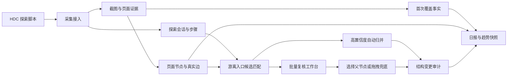

# 游离子图归并与图谱建设日报完整方案

## 1. 文档目标

本文将两个能力统一纳入 App Graph：

1. 批量处理人工通过 HDC、截图和 AI 识别发现的游离页面。
2. 基于图谱建设过程生成早报、晚报和历史趋势。

这两个能力共用同一套页面、边、探索会话和覆盖事件数据，但解决的问题不同：

- 游离归并回答“页面属于哪一片结构，如何进入”。
- 首次覆盖回答“某个 APP + URL 何时第一次具备有效页面证据”。
- 日报回答“本期新增了什么，整体覆盖进展如何”。

## 2. 核心术语

| 名称 | 定义 |
|---|---|
| 页面节点 | 图谱中的功能页面，同一 URL 可以对应多个页面节点 |
| 游离节点 | 已采集但当前无法从主树根节点到达的页面节点 |
| 游离子图 | 游离节点之间已经存在真实边关系，但整体入口尚未接入主树的连通区域 |
| 主树 | 从真实应用入口页面沿已确认边可达的页面结构 |
| `APP_ROOT` | 逻辑总入口，不代表真实页面，不参与脚本点击执行 |
| 覆盖 | 页面拥有有效截图、识别结果及有效 `embeddingText` |
| 首次覆盖 | APP + URL 第一次从未覆盖变为已覆盖 |
| 结构归并 | 游离节点或游离子图建立有效父边并接入主树 |
| 临时入口边 | 未找到真实入口时连接到 `APP_ROOT` 的不可执行虚拟边 |

## 3. 必须分离的状态

不能使用一个 `orphan` 字段同时表达数据覆盖和图结构状态。推荐状态模型：

```text
structureStatus: ORPHAN | PENDING_ENTRY | MERGED
coverageStatus: UNCOVERED | COVERED
reviewStatus: PENDING | AUTO_CONFIRMED | MANUAL_CONFIRMED | REJECTED
```

关键时间字段：

| 字段 | 含义 | 是否允许刷新 |
|---|---|---|
| `firstCoverageTime` | APP + URL 第一次获得有效覆盖的时间 | 否 |
| `resolvedAt` | 游离节点完成结构归类的时间 | 是，重新归类时生成新审计事件 |
| `createdAt` | 页面节点或证据首次入库时间 | 否 |
| `updatedAt` | 普通内容最后修改时间 | 是 |

以下操作不能刷新 `firstCoverageTime`：

- 修改标题、描述、图片和动作。
- 调整父子关系。
- 同一 URL 创建新的页面节点。
- 删除后重新上传已经覆盖过的 APP + URL。

## 4. 总体架构



## 5. 游离节点批量归并方案

### 5.1 采集阶段补充上下文

HDC 发现页面时，除了 URL 和截图，还应上传：

```json
{
  "appName": "QQ",
  "pageUrl": "MainAbility,/pages/message",
  "explorationSessionId": "session-001",
  "previousPageId": "page-home",
  "previousPageUrl": "MainAbility,/pages/home",
  "entryWidget": "消息",
  "actionType": "CLICK",
  "stepIndex": 12,
  "functionArea": "消息",
  "screenshotFileName": "session-001-012.png"
}
```

`previousPageId` 和会话步骤是最强证据。真实执行链能够确定父节点时，不需要 AI 猜测。

### 5.2 先形成子图，再确定入口

当一次探索得到 `B -> C -> D -> E`，但 B 找不到已有父节点时：

1. 保留 B、C、D、E 的真实内部边。
2. 将 B 标记为候选入口。
3. 将整个连通区域保存为一个游离子图。
4. 人工只处理 B 的入口，不逐个拖拽四个节点。

如果后续发现 `A -> B`，则整个子图一次性接入主树。

### 5.3 找不到真实父节点

不得默认创建 `root -> B` 的普通导航边。应创建不可执行的临时入口边：

```json
{
  "sourcePageId": "app-root",
  "targetPageId": "page-b",
  "edgeType": "PROVISIONAL_ENTRY",
  "reviewStatus": "PENDING",
  "isExecutable": false,
  "reason": "发现独立功能区，尚未发现真实入口"
}
```

真实入口可以是：

| 进入方式 | 边类型 |
|---|---|
| 页面按钮或底部 Tab | `PAGE_NAVIGATION` |
| Deep Link | `DEEPLINK` |
| 通知栏 | `NOTIFICATION` |
| 其他 APP 唤起 | `EXTERNAL_APP` |
| 系统 Intent | `SYSTEM_INTENT` |
| 尚未确定 | `PROVISIONAL_ENTRY` |

测试用例生成器必须过滤 `isExecutable=false` 的边。

### 5.4 父节点候选评分

后台先通过规则和索引召回同 APP 的候选父节点，再计算综合分数：

| 证据 | 建议权重 |
|---|---:|
| HDC 上一步页面、会话和步骤 | 40% |
| Function Tree 功能区 | 20% |
| 截图、标题和页面文本语义 | 15% |
| URL、Ability 和路由容器 | 15% |
| 父节点控件与进入动作 | 10% |

置信度分流：

```text
score >= 0.92        自动归并并保留审计，可撤销
0.75 <= score < 0.92 进入批量复核
score < 0.75         人工选择父节点或拖拽
```

阈值必须通过真实样本校准，不将建议值直接作为生产常量。

### 5.5 减少 AI 调用

匹配顺序：

1. HDC 前序页面和已有真实边。
2. URL、Ability、控件和 Function Tree 的确定性规则。
3. pgvector Top-K 语义召回与本地评分。
4. 将 20 至 50 条灰区记录组成一次 AI 批量复核。
5. 低置信度记录交给人工。

禁止为每个游离节点单独调用一次 AI。

### 5.6 批量复核工作台

游离节点过多时，主要交互应从树拖拽切换为复核表格：

| 页面 | 所属子图 | 推荐父节点 | 置信度 | 匹配依据 | 状态 |
|---|---|---|---:|---|---|
| 联系人详情 | 消息区域 | 消息列表 | 96% | HDC 前序 + 控件 | 可自动归并 |

工作台支持：

- 接受全部高置信度建议。
- 多选后批量接受或批量指定父节点。
- 按候选父节点、功能区、探索会话分组。
- 展示截图、入口控件、HDC 路径和前三个候选。
- 双击定位候选父节点。
- 整个子图拖拽归类。
- 对单条结果拒绝、改派或保留待确认。
- 按批次撤销结构变更。

### 5.7 归并成功标准

接口成功不等于结构归并成功。前端重新获取图谱后必须确认：

1. 节点已从 `orphans` 消失。
2. 从真实根节点可以沿 `children` 或可执行边到达该节点。
3. 新父边存在，父子节点属于同一 APP。
4. 未产生自引用、环或重复活动边。
5. 前端使用的 `graphVersion` 与后台一致。

临时挂到 `APP_ROOT` 的子图仍为 `PENDING_ENTRY`，不能计为真实结构归并。

## 6. 首次覆盖事实

### 6.1 为什么不能使用 `updatedAt`

`updatedAt` 可能由标题、图片、动作编辑或批量 SQL 更新，无法证明 URL 在该时刻首次获得有效覆盖。

正确设计包含两层：

- 节点覆盖事件：记录每个 `pageId` 的覆盖状态变化，允许同一 URL 多条。
- URL 首次覆盖事实：一个 APP + URL 只保留最早的有效覆盖时间。

### 6.2 触发规则

以下场景尝试登记首次覆盖：

- 新页面入库时 `embeddingText` 已有效。
- 已有页面的 `embeddingText` 从空变为有效。
- AI 探索或人工补录产生有效页面证据。

登记必须与页面写入处于同一事务，并保证并发幂等。

### 6.3 历史基线

系统上线前已经覆盖的 URL 写入基线，建议：

```text
isBaseline = true
firstCoverageTime = null
```

日报不将基线算作上线当日新增。不能把上线时间批量写成历史 URL 的首次覆盖时间。

## 7. 图谱建设日报

### 7.1 时间口径

使用北京时间和左闭右开区间：

```text
早报：[前一天 20:00, 当天 08:00)
晚报：[当天 08:00, 当天 20:00)
```

本期新增使用固定时间区间；节点数、游离数和累计覆盖率使用生成报告时的实时快照。

### 7.2 指标定义

| 指标 | 定义 |
|---|---|
| 新增 URL | `firstCoverageTime` 落在本期且非基线的 APP + URL 数 |
| 涉及 APP | 本期至少有一个新增 URL 的 APP 数 |
| 节点数 | 有效覆盖的页面节点记录数，不按 URL 去重 |
| 游离 URL | 当前没有任何有效覆盖节点的 APP + URL 数 |
| 已覆盖 URL | 当前至少存在一个有效覆盖节点的 APP + URL 数 |
| 高频 URL 覆盖率 | 已覆盖高频 URL 合计 / 高频 URL 清单合计 |
| 全量 URL 覆盖率 | `min(已覆盖 URL, 全量 URL)` 合计 / 全量 URL 合计 |
| 全量覆盖率去 0 | 只统计已覆盖 URL 大于 0 的 APP |

同一 URL 同时存在已覆盖节点和未覆盖节点时，URL 口径优先判定为已覆盖，不再计入游离 URL。

### 7.3 数据来源

| 数据 | 来源 |
|---|---|
| APP、节点、URL、覆盖状态 | PostgreSQL 图谱数据 |
| 首次覆盖时间 | URL 首次覆盖事实表 |
| TOP/TGI 与全量 URL 分母 | 本地配置或 `统计url.xlsx` |
| 高频 URL | `specificUrl.xlsx` B 列，按 APP + URL 精确匹配 |
| 三方功能数 | 最新版本 Function Tree |
| 历史趋势 | 日报快照表 |
| 特殊说明 | 人工配置，AI 推测必须标记为待确认 |

### 7.4 页面组成

日报采用现有 Vben Admin、Ant Design Vue 和 ECharts 风格：

1. 标题、报告类型、生成时间和统计区间。
2. 五张卡片：新增 URL、涉及 APP、高频覆盖率、全量覆盖率、全量覆盖率去 0。
3. 新增 URL 数量趋势图。
4. 全量 URL 覆盖率趋势图，显示分子和分母。
5. TOP/TGI 切换及 11 列 APP 进展表。
6. 点击 APP 打开 URL 明细抽屉。
7. 点击 URL 跳转图谱并定位对应的一个或多个页面节点。
8. 支持生成独立 HTML，图表资源不依赖外网 CDN。

11 列 APP 进展表固定为：

```text
APP 名称
节点数
全量 URL 总数
游离 URL 数
已覆盖 URL
全量 URL 覆盖率
高频 URL 总数
已覆盖高频 URL
高频 URL 覆盖率
三方功能数
特殊说明
```

## 8. 数据闭环

```text
HDC 发现页面
-> 保存截图、URL、动作和前序页面
-> 页面去重及覆盖登记
-> 构建真实边或游离子图
-> 自动匹配入口
-> 批量复核或人工拖拽兜底
-> 重新查询并验证结构
-> 写入结构审计
-> 日报按 firstCoverageTime 统计新增
-> URL 明细可回到图谱定位
```

## 9. 产品验收原则

- 100 个游离节点不要求用户执行 100 次拖拽。
- 找不到入口的新区域不会生成虚假的可执行边。
- 同一 URL 可以存在多个页面节点，但日报只统计一次首次覆盖。
- 修改图片、标题和动作不会制造新增 URL。
- 批量归并可追踪、可撤销、可重新校验。
- 日报中的 URL 可以定位回图谱、Function Tree 和测试结果。
