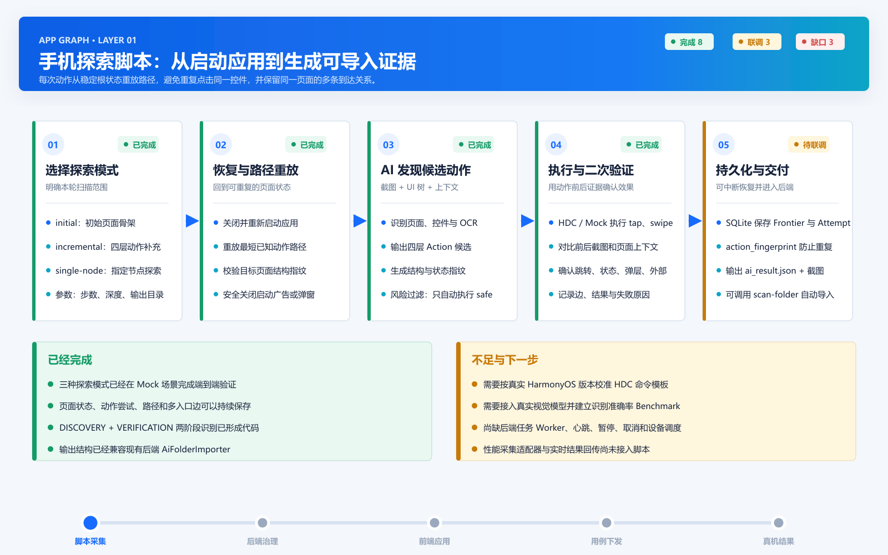
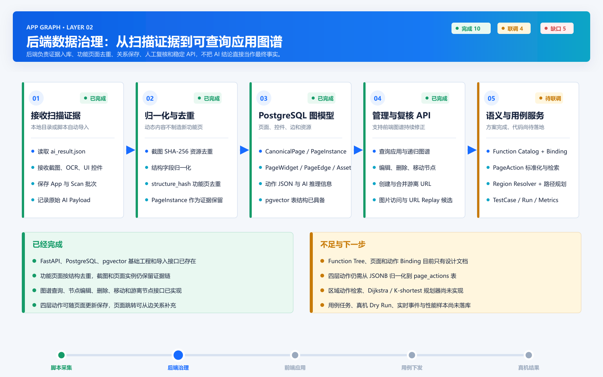
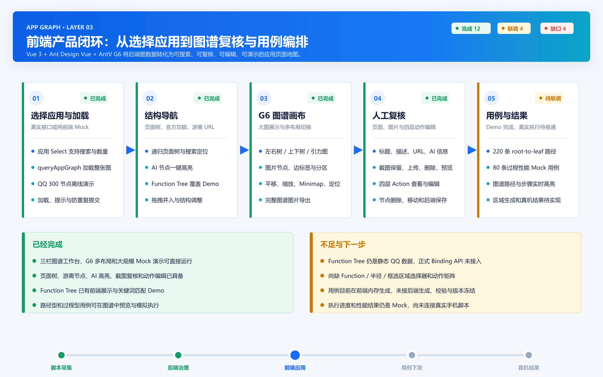

# App Graph 端到端系统流程总览

## 1. 从头到尾做了什么

```text
手机脚本启动第三方应用
-> 截图、读取 UI、识别页面和四层动作
-> 执行安全动作并比较动作前后证据
-> 保存页面、截图、动作、边和探索记忆
-> 生成 ai_result.json
-> FastAPI 导入本地扫描目录
-> PostgreSQL 保存应用、页面实例、标准页面、控件、边和资源
-> 按 structure_hash 合并相同功能页面
-> API 向前端提供应用列表、图谱、图片和编辑能力
-> Vue 3 + AntV G6 展示页面关系图谱
-> 用户查看截图、复核 AI、编辑四层动作和调整结构
-> 前端根据图谱展示路径型与过程型用例
-> 后续由后端冻结用例并重新下发给手机脚本
-> 脚本执行真实用例并回传性能结果
```

当前已经打通的是：

```text
脚本 Mock 探索
-> ai_result.json
-> 后端导入与图谱 API
-> 前端图谱展示、人工复核和 Mock 用例编排
```

尚未完全打通的是：

```text
前端区域选取
-> 后端真实用例生成和路径校验
-> 任务下发
-> 真机执行
-> 性能数据实时回传
-> Function / Action / Requirement 覆盖闭环
```

## 2. 脚本探索流程



可编辑源文件：

```text
docs/assets/system-flows/01-script-exploration-flow.svg
```

## 3. 后端数据治理流程



可编辑源文件：

```text
docs/assets/system-flows/02-backend-data-governance-flow.svg
```

## 4. 前端产品流程



可编辑源文件：

```text
docs/assets/system-flows/03-frontend-product-flow.svg
```

## 5. 当前工程判断

### 已经具备

- 脚本三种探索模式、动作记忆和可导入扫描结果。
- 后端页面去重、证据保存、图谱查询和节点管理。
- 前端大规模 G6 图谱、页面复核、动作编辑和 Mock 用例。
- Function Tree、区域行为检索和 AI 用例生成的工程设计。

### 下一阶段

1. 使用真实手机和真实视觉模型验证探索脚本。
2. 后端落地 Function Catalog、Binding 和标准化 PageAction。
3. 实现 Region Resolver、动作检索和确定性路径规划。
4. 将前端 Mock 用例替换为后端生成、校验和版本冻结。
5. 建立任务 Worker，将用例下发给手机并回传性能样本。

## 6. 图片生成方式

三张图片由以下脚本统一生成：

```text
docs/assets/system-flows/generate-flows.cjs
```

重新生成需要 Node.js 和 `sharp`：

```powershell
node docs/assets/system-flows/generate-flows.cjs
```
